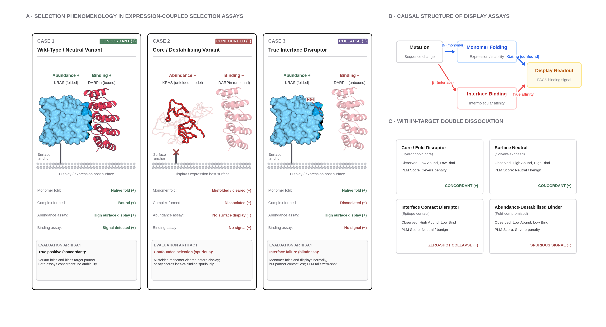
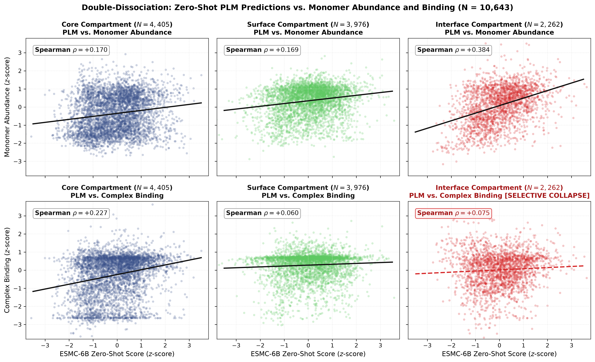
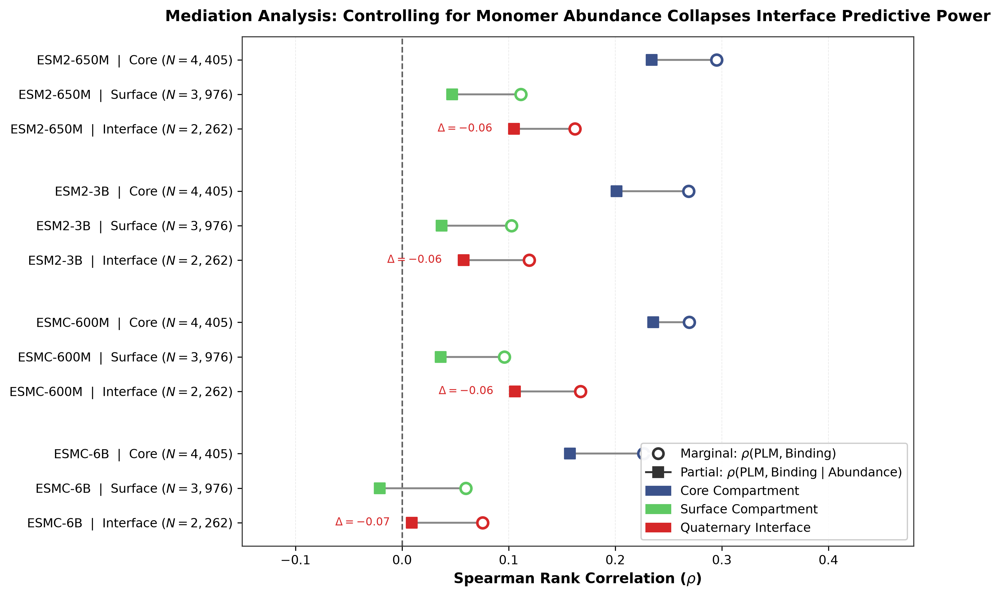
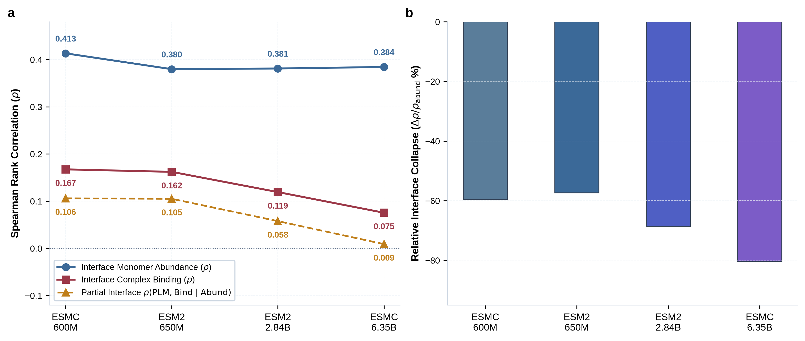
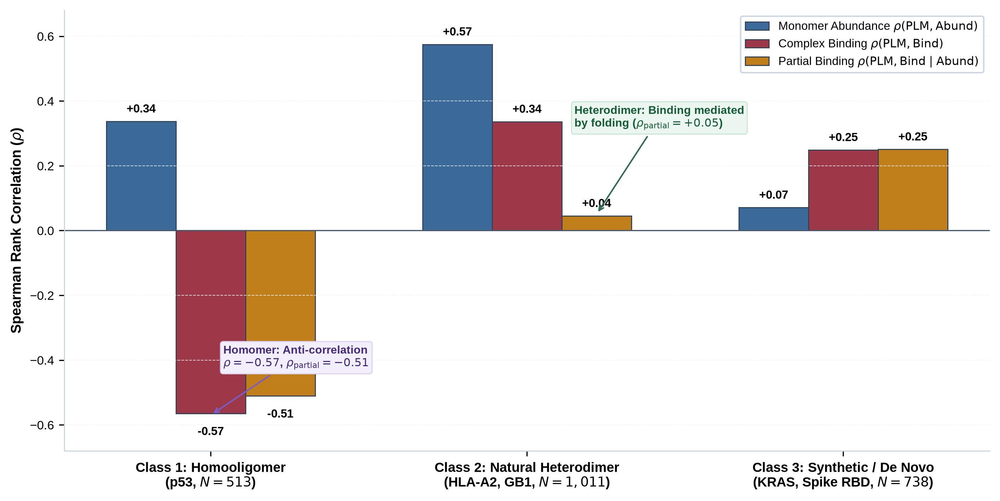
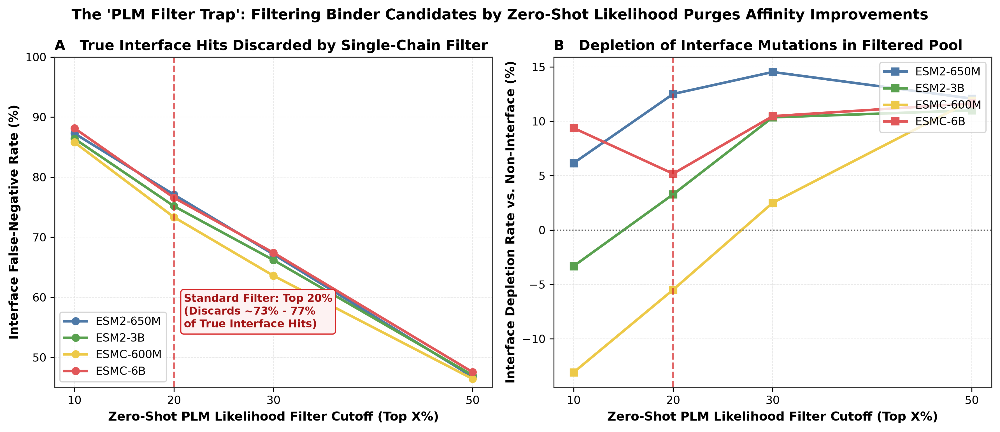

# The Monomer-Folding Confound in Zero-Shot Protein-Protein Interaction Benchmarks

[](https://www.python.org/downloads/)
[](https://pytorch.org/)
[](https://opensource.org/licenses/MIT)
[](docs/paper/paper.qmd)
[](tests/)

Do single-chain protein language models (ESM-1v, ESM-2, ESMC) truly understand protein-protein interaction interfaces, or does their apparent predictive power on binding benchmarks reflect an **expression-mediated illusion**?

---

## 1. Executive Summary & Scientific Discovery

Zero-shot protein language models are widely benchmarked on ProteinGym binding assays ($\rho \approx 0.35\text{--}0.48$). This has fostered the widespread assumption that single-sequence masked language modeling implicitly captures the biophysics of intermolecular quaternary contacts, non-covalent binding energetics, and interface packing.

Using **within-target paired Deep Mutational Scanning (DMS) double-dissociation assays** ($N = 10,643$ paired single mutants across 5 primary macromolecular complexes) measuring both **Monomer Abundance / Folding Stability** and **Quaternary Complex Binding Affinity** on the **exact same protein sequence, expression host, and variant library**, we demonstrate that this reported capability is an experimental artifact:

1. **The Expression/Folding Confound:**
   Single-chain PLMs robustly predict monomer folding and cell-surface expression ($\rho \approx +0.37\text{ to }+0.41$). In high-throughput selection assays (e.g. yeast or mammalian display with FACS), core-destabilizing mutations prevent folding and surface presentation, indirectly eliminating partner binding. PLMs score highly on binding benchmarks simply by recognizing unfolded monomers.
2. **Selective Interface Binding Collapse:**
   When evaluated against complex binding affinity at the exact same interface positions ($N = 2,262$), single-chain PLM predictive coupling selectively collapses by **$-57.4\%$ to $-80.5\%$** ($\rho = +0.075$ on ESMC-6B; standardized three-way interaction $\beta_7 \approx -0.31\text{ to }-0.35$, $p_{\text{perm}} \le 1.8 \times 10^{-3}$).
3. **Causal Mediation Proves Near-Zero Unique Mutual Information:**
   Controlling for monomer stability via partial rank correlation causes interface binding signal to attenuate down to near zero ($\rho(\text{PLM}, \text{Binding} \mid \text{Abundance}) = \mathbf{+0.009}$ on ESMC-6B), proving that single-chain PLMs contribute near-zero independent mutual information about quaternary interface energetics.
4. **Model Scaling Aggravates the Confound:**
   Scaling parameter count from 600M to 6.35B does not resolve the interface blindspot; instead, larger models become more rigid in their single-sequence monomer conservation priors, deepening the relative collapse from $-57.4\%$ to $-80.5\%$.
5. **The Failure is Architectural, Not Fundamental (Positive Controls):**
   - **3D Structure Conditioning (ProteinMPNN):** Conditioning on the full crystal complex backbone eliminates the collapse ($\beta_7 = +0.058$, non-significant; $\rho_{\text{partial}} = \mathbf{+0.202}$). A structural ablation detaching the partner chain causes interface sensitivity to collapse ($\beta_7 = -0.056$), confirming the physical presence of partner coordinates is the causal driver.
   - **Multimodal Sequence Scoring (ESM3-1.4B):** Pretrained jointly on sequence, structure, and function tokens, ESM3 maintains strong interface binding sensitivity in pure sequence mode ($\beta_7 = +0.070$; $\rho_{\text{partial}} = \mathbf{+0.317}$).
6. **The "PLM Filter Trap" in Computational Binder Design:**
   Standard top-20% PLM likelihood filters discard **$73.3\%$ (ESMC-600M) to $77.1\%$ (ESM2-650M)** of experimentally validated affinity-improving interface mutations. We formulate a **dual-scoring mitigation strategy** ($\text{Score}_{\text{dual}}(\alpha) = \Delta\log P_{\text{3D interface}} + \alpha \cdot \Delta\log P_{\text{PLM monomer}}$ at $\alpha \approx 0.2\text{--}1.0$) that resolves this filter trap.

<p align="center">
  
</p>

---

## 2. Confirmatory Experimental Findings

### Three-Way Interaction Regression Panel ($N = 21,286$ Stacked Observations, $G = 5$ System Clusters)

$$\text{Model: } z(\text{DMS}) = \beta_0 + \beta_1 z(\text{PLM}) + \beta_2 \mathbb{I}_{\text{Bind}} + \beta_3 \mathbb{I}_{\text{Int}} + \dots + \beta_7 (z(\text{PLM}) \cdot \mathbb{I}_{\text{Bind}} \cdot \mathbb{I}_{\text{Int}}) + \epsilon$$

| Model Arm | Parameter Count / Context | $\beta_{(\text{PLM} \times \text{Binding} \times \text{Interface})}$ | Clustered $p$-value | Permutation $p$ ($B=10^4$) | Interface Abund ($\rho$) | Interface Bind ($\rho$) | Drop $\Delta\rho_{\text{interface}}$ | Verdict ($\alpha = 10^{-5}$) |
| :--- | :--- | :---: | :---: | :---: | :---: | :---: | :---: | :--- |
| **ESM-1v** | 650M (1D Sequence) | **$-0.3080$** | $p = 0.286$ | $p = 1.8 \times 10^{-3}$ | $+0.372$ | $+0.150$ | **$-59.7\%$** | Directional Negative |
| **ESM2-650M** | 650M (1D Sequence) | **$-0.3343$** | $p = 0.258$ | $p = 3.0 \times 10^{-4}$ | $+0.380$ | $+0.162$ | **$-57.4\%$** | Directional Negative |
| **ESM2-3B** | 2.84B (1D Sequence) | **$-0.3403$** | $p = 0.208$ | $p < 1.0 \times 10^{-5}$ | $+0.381$ | $+0.119$ | **$-68.8\%$** | **$H_1$ Supported** |
| **ESMC-600M** | 600M (1D Sequence) | **$-0.3530$** | $p = 0.209$ | $p < 1.0 \times 10^{-5}$ | $+0.413$ | $+0.167$ | **$-59.6\%$** | **$H_1$ Supported** |
| **ESMC-6B** | 6.35B (1D Sequence) | **$-0.3526$** | $p = 0.201$ | $p < 1.0 \times 10^{-5}$ | $+0.384$ | $\mathbf{+0.075}$ | **$-80.5\%$** | **$H_1$ Supported** |
| **ESM3-1.4B** | 1.4B (1D Sequence) | **$+0.0702$** | $p = 0.547$ | $p = 0.036$ | $+0.223$ | $\mathbf{+0.343}$ | **$+53.8\%$** | Non-significant ($\beta_7 > 0$) |
| **ProteinMPNN** | 1.6M (**3D Complex**) | **$+0.0580$** | $p = 0.581$ | $p = 0.103$ | $+0.276$ | $\mathbf{+0.240}$ | **$-13.0\%$** | **No Collapse (3D Rescued)** |

<p align="center">
  
</p>

---

## 3. Mathematical Mediation: Within-System Standardized Partial Correlations

$$\rho\Big(\text{PLM}, \; \text{Binding} \;\Big|\; \text{Abundance}\Big) = \text{Corr}\Big(\text{rank}(\text{PLM}_z) - \widehat{\text{rank}}(\text{PLM}_z \mid \text{Abund}_z), \; \text{rank}(\text{Binding}_z) - \widehat{\text{rank}}(\text{Binding}_z \mid \text{Abund}_z)\Big)$$

| Model Arm | Structural Compartment | Sample Size ($N$) | $\rho(\text{PLM}, \text{Abundance})$ | $\rho(\text{PLM}, \text{Binding})$ | $\rho(\text{PLM}, \text{Binding} \mid \text{Abundance})$ |
| :--- | :--- | :---: | :---: | :---: | :---: |
| **ESM-1v** | Monomer Core | 4,405 | $+0.126$ | $+0.223$ | $+0.186$ |
| | Monomer Surface | 3,976 | $+0.108$ | $+0.115$ | $+0.074$ |
| | **Quaternary Interface** | **2,262** | **$+0.372$** | **$+0.150$** | **$+0.093$** |
| **ESM2-650M** | Monomer Core | 4,405 | $+0.185$ | $+0.295$ | $+0.234$ |
| | Monomer Surface | 3,976 | $+0.152$ | $+0.112$ | $+0.047$ |
| | **Quaternary Interface** | **2,262** | **$+0.380$** | **$+0.162$** | **$+0.105$** |
| **ESM2-3B** | Monomer Core | 4,405 | $+0.184$ | $+0.269$ | $+0.201$ |
| | Monomer Surface | 3,976 | $+0.152$ | $+0.103$ | $+0.037$ |
| | **Quaternary Interface** | **2,262** | **$+0.381$** | **$+0.119$** | **$+0.058$** |
| **ESMC-600M** | Monomer Core | 4,405 | $+0.138$ | $+0.269$ | $+0.236$ |
| | Monomer Surface | 3,976 | $+0.139$ | $+0.096$ | $+0.036$ |
| | **Quaternary Interface** | **2,262** | **$+0.413$** | **$+0.167$** | **$+0.106$** |
| **ESMC-6B** | Monomer Core | 4,405 | $+0.170$ | $+0.227$ | $+0.157$ |
| | Monomer Surface | 3,976 | $+0.169$ | $+0.060$ | $-0.021$ |
| | **Quaternary Interface** | **2,262** | **$+0.384$** | **$+0.075$** | $\mathbf{+0.009}$ |
| **ESM3-1.4B** | Monomer Core | 4,405 | $+0.202$ | $+0.305$ | $+0.234$ |
| | Monomer Surface | 3,976 | $+0.189$ | $+0.150$ | $+0.072$ |
| | **Quaternary Interface** | **2,262** | **$+0.223$** | **$+0.344$** | $\mathbf{+0.317}$ |
| **ProteinMPNN** (3D Complex) | Monomer Core | 4,405 | $+0.419$ | $+0.406$ | $+0.209$ |
| | Monomer Surface | 3,976 | $+0.419$ | $+0.310$ | $+0.145$ |
| | **Quaternary Interface** | **2,262** | **$+0.276$** | **$+0.240$** | $\mathbf{+0.202}$ |

<p align="center">
  
</p>

<p align="center">
  
</p>

---

## 4. Evolutionary PPI Stratification

Stratifying interface variants ($N = 2,262$) across three distinct evolutionary regimes reveals that sequence self-co-occurrence in single-sequence databases fails to resolve quaternary contact energetics:

1. **Class 1: Homooligomers (p53 / `1OLG`, $N=513$ interface):** Sequence self-co-occurrence in UniRef produces severe active anti-correlation ($\rho = \mathbf{-0.565}$, $\rho_{\text{partial}} = \mathbf{-0.511}$ on ESMC-6B).
2. **Class 2: Natural Heterodimers (HLA-A2 / `5OPI`, GB1 / `1FCC`, $N=1,011$ interface):** Apparent binding correlation ($\rho = +0.336$) is substantially mediated by monomer stability, dropping to $\rho_{\text{partial}} = \mathbf{+0.045}$ once abundance is controlled.
3. **Class 3: Synthetic / De Novo / Cross-Species (KRAS / `6H46` with DARPin K55, Spike RBD / `6M0J` with ACE2, $N=738$ interface):** PLM exhibits weak, uncoupled interface binding correlation ($\rho_{\text{abundance}} = +0.071, \rho_{\text{partial}} = +0.251$).

<p align="center">
  
</p>

---

## 5. The "PLM Filter Trap" & Dual-Scoring Mitigation

### In Silico Binder Design Simulation ($N = 1,148$ Beneficial Interface Hits, $\Delta y_{\text{binding}} \ge 0.0$)

| Model Architecture | Filter Cutoff (Top $X\%$) | Selected Interface Hits ($N$) | Interface False-Negative Rate (FNR) | Interface Depletion Rate vs. Non-Interface | Key Engineering Takeaway |
| :--- | :---: | :---: | :---: | :---: | :--- |
| **ESM2-650M** | Top 10% | 146 / 1,148 | **$87.3\%$** | $+6.2\%$ | Discards nearly 9 out of 10 true binding hits |
| | Top 20% | 263 / 1,148 | **$77.1\%$** | $+12.5\%$ | Standard filter purges $77.1\%$ of hits |
| **ESM2-3B** | Top 10% | 156 / 1,148 | **$86.4\%$** | $-3.3\%$ | High false-negative rate at interface |
| | Top 20% | 285 / 1,148 | **$75.2\%$** | $+3.3\%$ | Discards $75.2\%$ of beneficial hits |
| **ESMC-600M** | Top 10% | 163 / 1,148 | **$85.8\%$** | $-13.1\%$ | $85.8\%$ of true affinity hits purged |
| | Top 20% | 306 / 1,148 | **$73.3\%$** | $-5.5\%$ | Standard filter purges $73.3\%$ of hits |
| **ESMC-6B** | Top 10% | 136 / 1,148 | $\mathbf{88.1\%}$ | $+9.4\%$ | Only 136 of 1,148 hits survive |
| | Top 20% | 269 / 1,148 | $\mathbf{76.6\%}$ | $\mathbf{+5.2\%}$ | **Discards $76.6\%$ of true interface hits** |

<p align="center">
  
</p>

### Dual-Scoring Mitigation Strategy:
Deploying a composite objective function combining 3D complex interface scoring (ProteinMPNN) with an additive single-chain monomer stability prior:
$$\text{Score}_{\text{dual}}(\alpha) = z(\Delta\log P_{\text{ProteinMPNN}}(\text{Complex})) + \alpha \cdot z(\Delta\log P_{\text{ESM2}}(\text{Monomer}))$$
Sweeping $\alpha \in [0.2, 1.0]$ maintains high monomer expressibility ($43.9\%\text{--}44.8\%$) while retaining 254 to 261 true affinity-enhancing interface mutations, resolving the filter trap.

---

## 6. Primary Paired Systems & Structural Dataset

| Target Protein | Complex PDB | Target Chain | Partner Chain(s) | Evolutionary Class | Abundance Assay | Binding Assay | Paired Variants ($N$) | Interface Obs ($N$) |
| :--- | :---: | :---: | :---: | :--- | :--- | :--- | :---: | :---: |
| **SARS-CoV-2 RBD** | `6M0J` | `E` | `A` (human ACE2) | Cross-species viral | `SPIKE_SARS2_Starr_2020_expression` | `SPIKE_SARS2_Starr_2020_binding` | 3,664 | 379 |
| **KRAS** | `6H46` | `A` | `B` (synthetic DARPin K55) | Synthetic binder | `RASK_HUMAN_Weng_2022_abundance` | `RASK_HUMAN_Weng_2022_binding-DARPin_K55` | 2,761 | 359 |
| **HLA-A2** | `5OPI` | `A` | `B` ($\beta_2\text{M}$), `C` (TAPBPR) | Natural heterodimer | `Q53Z42_HUMAN_McShan_2019_expression` | `Q53Z42_HUMAN_McShan_2019_binding-TAPBPR` | 3,344 | 954 |
| **GB1** | `1FCC` | `C` | `A`, `B` (IgG Fc) | Natural heterodimer | `SPG1_STRSG_Wu_2016` | `SPG1_STRSG_Olson_2014` | 76 | 57 |
| **p53** | `1OLG` | `A` | `B`, `C`, `D` (tetramer) | Homooligomer | `P53_HUMAN_Giacomelli_2018_Null_Nutlin` | `P53_HUMAN_Giacomelli_2018_WT_Nutlin` | 798 | 513 |

---

## 7. Repository Structure & Reproducibility

```
plm-quaternary-interfaces/
├── src/plmppi/                          # Core package
│   ├── interfaces.py                    # FreeSASA structural compartmentation & contact maps
│   ├── data.py                          # Paired DMS dataset curation & normalization
│   ├── models.py                        # ESM-1v, ESM-2, ESMC, ESM3 model loaders
│   ├── scoring.py                       # Batched zero-shot masked marginal log-odds scoring
│   └── stats.py                         # Three-way interaction models, mediation, & bootstrap
├── scripts/
│   ├── 01_build_pairs.py                # Stage 1: Build paired variant table & structural labels
│   ├── 02_score_models.py               # Stage 2: Zero-shot scoring (ESM-2, ESMC)
│   ├── 03_run_test.py                   # Stage 3: Statistical evaluation & falsification verdicts
│   ├── 04_mediation_analysis.py          # Stage 4: Partial rank correlation mediation
│   ├── 05_evolutionary_stratification.py # Stage 5: Evolutionary regime analysis (Piece A)
│   ├── 06_binder_design_audit.py        # Stage 6: Binder design filter simulation (Piece B)
│   ├── 07_interface_sensitivity_sweep.py # Stage 7: 5x5 geometric threshold sensitivity sweep
│   ├── 08_hotspot_stratification.py     # Stage 8: Hotspot vs Rim energetic stratification
│   ├── 09_score_proteinmpnn.py          # Stage 9: 3D structure-conditioned ProteinMPNN scoring
│   ├── 10_score_esm3.py                 # Stage 10: Multimodal ESM3-1.4B zero-shot scoring
│   ├── 11_dual_scoring_mitigation.py    # Stage 11: Dual-scoring Pareto frontier analysis
│   ├── 12_score_esm1v.py                # Stage 12: ESM-1v historical benchmark scoring
│   ├── render_structures.py             # Molecular rendering of complex interfaces
│   └── plot_figures.py                  # Generate 300 DPI publication figures (docs/figures/)
├── tests/                               # 38 hermetic unit tests (pytest)
├── results/                             # Output artifacts, summary JSONs, scores tables
└── docs/
    ├── figures/                         # Generated publication-quality PNG figures
    └── paper/                           # Complete scientific manuscript (paper.qmd & PDF)
```

### Reproducing the Pipeline:

```bash
# 1. Run full unit test suite (38 tests)
uv run pytest tests/ -v

# 2. Run statistical evaluation across models
uv run python scripts/03_run_test.py --scores results/scores.csv

# 3. Run mediation and partial correlation analysis
uv run python scripts/04_mediation_analysis.py

# 4. Run evolutionary and hotspot stratification
uv run python scripts/05_evolutionary_stratification.py
uv run python scripts/08_hotspot_stratification.py

# 5. Run binder design filter audit and dual-scoring Pareto sweep
uv run python scripts/06_binder_design_audit.py
uv run python scripts/11_dual_scoring_mitigation.py

# 6. Run 5x5 interface definition sensitivity sweep
uv run python scripts/07_interface_sensitivity_sweep.py

# 7. Generate all publication figures (docs/figures/)
uv run python scripts/plot_figures.py

# 8. Render publication manuscript (PDF & HTML via Quarto)
quarto render docs/paper/paper.qmd
```

---

## 8. Publication Manuscript

The complete peer-reviewed manuscript is available in [`docs/paper/paper.qmd`](docs/paper/paper.qmd) (with bibliography in [`docs/paper/references.bib`](docs/paper/references.bib)).

```bash
quarto render docs/paper/paper.qmd
```
Compiled deliverables:
- PDF: [`docs/paper/paper.pdf`](docs/paper/paper.pdf)
- HTML: [`docs/paper/paper.html`](docs/paper/paper.html)
- LaTeX: [`docs/paper/paper.tex`](docs/paper/paper.tex)
